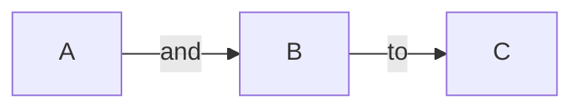

# A first-level heading

## A second-level heading

### A third-level heading

#### A four-level heading

##### A five-level heading

###### A six-level heading

Lorem ipsum dolor sit amet, consectetur adipiscing elit. Etiam est odio, commodo id diam sed, pulvinar sagittis tortor. Nam vestibulum purus eros. Sed congue, mi id pretium auctor, nibh augue iaculis arcu, eu tristique quam dolor at erat.

Quisque vel odio condimentum, mollis sem vitae, porta diam. Praesent ligula elit, condimentum eget ex sed, commodo sollicitudin sapien.

Proin volutpat faucibus nulla. Nullam eros sem, ultricies gravida nunc nec, dapibus posuere nisl. Nunc lacinia elementum turpis in pharetra. Aenean eu neque eros.

<!-- This content will not appear in the rendered Markdown -->

## Bold

**your text**

## italics

_your text_
_your text_

## strikethrough

~~your text~~

## subscript

The subscript <sub> text </sub> is here.

## superscript

The subscript <sup> text </sup> is here.

> Text that is a quote

## Code Block

## Inline code

JavaScript provides three different value comparison operations: strict equality using `===`, loose equality using `==`, and the `Object.is()` method.

## Code Block

```javascript
// ES5 syntax
var multiply = function (x, y) {
  return x * y;
};

// ES6 arrow function
var multiply = (x, y) => {
  return x * y;
};

// Or even simpler
var multiply = (x, y) => x * y;
```

### Links

A markdown file divides links into two categories: **inline** and **relative**.

#### Inline links

To create an inline link in a Markdown file, wrap the link text in brackets `[ ]` followed immediately by the URL in parentheses `( )`.

This site was built using [GitHub Pages](https://pages.github.com/).

[Contribution guidelines](docs/CONTRIBUTING.md)

[Contribution guidelines](../docs/CONTRIBUTING.md)


1. one
2. two
3. three
4. four

- First item
- Second item
- Third item
- Fourth item

* First item
* Second item
* Third item
* Fourth item

- First item
- Second item
- Third item
- Fourth item

## Task list

- [x] #739
- [ ] https://github.com/octo-org/octo-repo/issues/740
- [ ] Add delight to the experience when all tasks are complete :tada:

## Team or company

Don't forget to leave a star on our repository! :star:

Here's a simple footnote,[^1] and here's a longer one.[^bignote]

[^1]: This is the first footnote.

[^bignote]: Here's one with multiple paragraphs and code.

> [!NOTE]
> Useful information that users should know, even when skimming content.

> [!TIP]
> Helpful advice for doing things better or more easily.

> [!IMPORTANT]
> Key information users need to know to achieve their goal.

> [!WARNING]
> Urgent info that needs immediate user attention to avoid problems.

> [!CAUTION]
> Advises about risks or negative outcomes of certain actions.

| First Header | Second Header |
| ------------ | ------------- |
| Content Cell | Content Cell  |
| Content Cell | Content Cell  |

<details>
  <summary>Click to here. </summary>

### You can add a message here

You can add text within a collapsed section.

You can add an image or a code block, too.

The collapsed syntax looks like this in the browser:


_Collapsed example in markdown._

### Creating diagrams

To add diagrams to a Markdown file, use triple backticks and wrap them inside quadruple backticks. Then, tell which identifier (Mermaid, GeoJSON, TopJSON, ASCII STL) you used for the diagram.

GitHub supports diagrams using four syntaxes: mermaid, geoJSON, topoJSON, and ASCII STL.

1. [Mermaid](#heading-mermaid)
2. [GeoJSON and TopoJSON](#heading-geojson-and-topojson)
3. [ASCII STL](#heading-ascii-stl)

#### Mermaid

[Mermaid](https://mermaid.js.org) is a Markdown-inspired tool that renders text into diagrams. You can create flow charts, sequence diagrams, pie charts, and more with Mermaid.

The GitHub-flavored Markdown has extended the functionality of using Mermaid with Markdown.

You can create flow charts, sequence diagrams, pie charts, and so on inside Markdown. GitHub handles the rest of that. So how do you render diagrams on the screen?

````

````

The mermaid syntax looks like this in the browser.


_Mermaid example in markdown._

#### GeoJSON and TopoJSON

You can use [GeoJSON](https://geojson.org/) or [TopoJSON](https://github.com/topojson/topojson) to add an interactive map to a GitHub repository in a README file or GitHub Wiki.

You can use code block syntax to add an interactive map.

1. GeoJSON can create a map by specifying coordinates. To add an interactive map, use the following syntax: ` ```geojson  your code ``` `
2. TopoJSON can create a map by specifying coordinates and shapes. To add an interactive map, use the following syntax: ` ```topojson  your code ``` `

**Example using GeoJSON:**

````markdown
```geojson
{
  "type": "FeatureCollection",
  "features": [
    {
      "type": "Feature",
      "id": 1,
      "properties": {
        "ID": 0
      },
      "geometry": {
        "type": "Polygon",
        "coordinates": [
          [
            [
              -90,
              35
            ],
            [
              -90,
              30
            ],
            [
              -85,
              30
            ],
            [
              -85,
              35
            ],
            [
              -90,
              35
            ]
          ]
        ]
      }
    }
  ]
}
```
````

**Example of TopJSON:**

`````markdown
````topojson
{
  "type": "Topology",
  "transform": {
    "scale": [0.0005000500050005, 0.00010001000100010001],
    "translate": [100, 0]
  },
  "objects": {
    "example": {
      "type": "GeometryCollection",
      "geometries": [
        {
          "type": "Point",
          "properties": {"prop0": "value0"},
          "coordinates": [4000, 5000]
        },
        {
          "type": "LineString",
          "properties": {"prop0": "value0", "prop1": 0},
          "arcs": [0]
        },
        {
          "type": "Polygon",
          "properties": {"prop0": "value0",
            "prop1": {"this": "that"}
          },
          "arcs": [[1]]
        }
      ]
    }
  },
  "arcs": [[[4000, 0], [1999, 9999], [2000, -9999], [2000, 9999]],[[0, 0], [0, 9999], [2000, 0], [0, -9999], [-2000, 0]]]
}
### ASCII STL

GitHub Flavored Markdown supports STL syntax. STL syntax allows you to add interactive 3D models in markdown. You can use the following syntax: ` ```stl your code.``` `

```markdown
```stl
solid cube_corner
  facet normal 0.0 -1.0 0.0
    outer loop
      vertex 0.0 0.0 0.0
      vertex 1.0 0.0 0.0
      vertex 0.0 0.0 1.0
    endloop
  endfacet
  facet normal 0.0 0.0 -1.0
    outer loop
      vertex 0.0 0.0 0.0
      vertex 0.0 1.0 0.0
      vertex 1.0 0.0 0.0
    endloop
  endfacet
  facet normal -1.0 0.0 0.0
    outer loop
      vertex 0.0 0.0 0.0
      vertex 0.0 0.0 1.0
      vertex 0.0 1.0 0.0
    endloop
  endfacet
  facet normal 0.577 0.577 0.577
    outer loop
      vertex 1.0 0.0 0.0
      vertex 0.0 1.0 0.0
      vertex 0.0 0.0 1.0
    endloop
  endfacet
endsolid
````
`````

````
The STL syntax looks like this in the browser:


_STL example in markdown._

### Mathematical expressions

You can add mathematical expressions, such as equations, terms, formulas, and so on, to a GitHub markdown file. GitHub uses [LaTeX](https://www.cmor-faculty.rice.edu/~heinken/latex/symbols.pdf) formatted within Markdown. There are two ways to add these expressions:

1. Writing inline math expressions
2. Writing math expressions as code blocks

#### Writing inline math expressions

An inline math expression starts with `$` and ends with `$`.

```markdown
Inline math expression example: $\sqrt{3x-1}+(1+x)^2$
````
